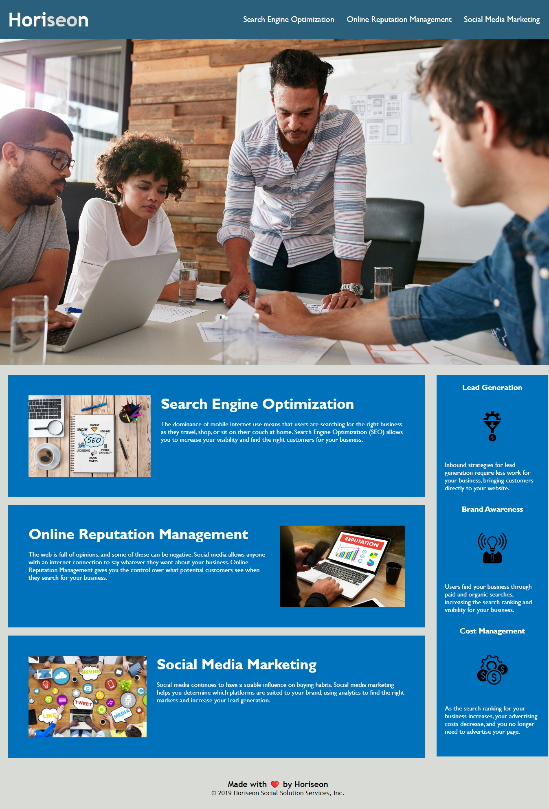

# Marketing Agency Accessibility

## Description

Refractoring existing code to make it more accessible so that the site is more optimized for search engines

## Usage

This is what the site should look like.  
Clicking the navigation links on the header will redirect you to the part of the page that your looking for.

## Credits

Source code from University of toronto bootcampspot Module 1 Challenge by Horiseon  
https://github.com/coding-boot-camp/urban-octo-telegram

Credits to w3schools.com for explaining Semantic Elements and when they should be used  
https://www.w3schools.com/html/html5_semantic_elements.asp
