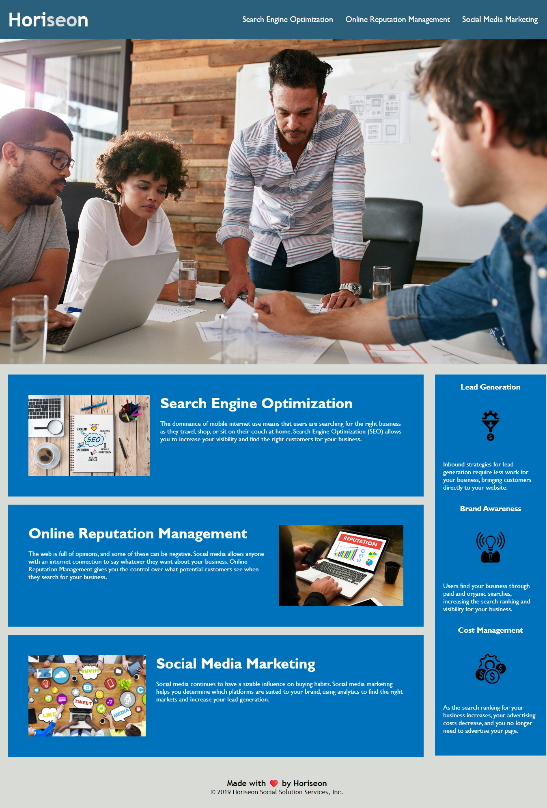

# Marketing Agency Accessibility

## Description

Purpose of this project is to learn how to refractor existing code to make it more accessible so that the site is more optimized for search engines  
Webpage did not have Semantic HTML and was not following Accessiblity standards  
Learned how to make Semantic HTML, Reducing repeated CSS code with seletors

## Usage

This is what the site should look like.  
Clicking the navigation links on the header will redirect you to the part of the page that your looking for.

Link to webpage: https://timebytes.github.io/Marketing-Agency-Accessibility/

## Credits

Source code from University of toronto bootcampspot Module 1 Challenge by Horiseon  
https://github.com/coding-boot-camp/urban-octo-telegram

Credits to w3schools.com for explaining Semantic Elements and when they should be used  
https://www.w3schools.com/html/html5_semantic_elements.asp

## License

MIT License
